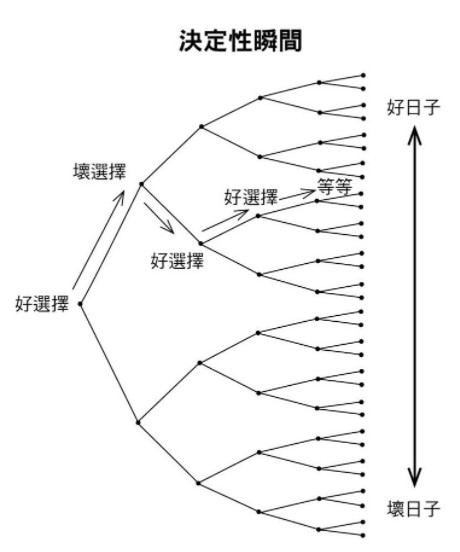

- [書本資訊](#書本資訊)
- [用一小段話敘述書本要傳達的內容](#用一小段話敘述書本要傳達的內容)
- [書本目錄&各章重點](#書本目錄各章重點)
  - [基本原理 - 為何細微改變會帶來巨大差異?](#基本原理---為何細微改變會帶來巨大差異)
    - [1.何謂習慣?](#1何謂習慣)
    - [2.改變習慣最有效的方法，"改變身分認同"](#2改變習慣最有效的方法改變身分認同)
    - [3.改變身分認同的兩個步驟](#3改變身分認同的兩個步驟)
    - [4.習慣形成的四個步驟](#4習慣形成的四個步驟)
    - [5.習慣迴路](#5習慣迴路)
    - [6.行為改變的四個法則](#6行為改變的四個法則)
  - [法則一:讓提示顯而易見](#法則一讓提示顯而易見)
    - [1.建立習慣計分卡](#1建立習慣計分卡)
    - [2.運用執行意象](#2運用執行意象)
    - [3.運用習慣堆疊](#3運用習慣堆疊)
    - [4.環境的影響](#4環境的影響)
    - [5.自律者](#5自律者)
  - [法則二:讓習慣具有吸引力](#法則二讓習慣具有吸引力)
    - [多巴胺](#多巴胺)
    - [誘惑綑綁](#誘惑綑綁)
    - [群體與吸引力](#群體與吸引力)
    - [行動的渴望](#行動的渴望)
    - [重新設定大腦](#重新設定大腦)
  - [法則三:讓行動輕而易舉](#法則三讓行動輕而易舉)
    - [行動的頻率](#行動的頻率)
    - [最小努力原則](#最小努力原則)
    - [決定性瞬間](#決定性瞬間)
    - [兩分鐘法則](#兩分鐘法則)
  - [法則四:讓獎賞令人滿足](#法則四讓獎賞令人滿足)
  - [進階策略 - 如何從 "A" 到 "A+"](#進階策略---如何從-a-到-a)
- [書本重點節錄](#書本重點節錄)
- [經典好句](#經典好句)
- [讀後心得](#讀後心得)
- [讀後實踐](#讀後實踐)
# 書本資訊
書名: Atomic Habits (中文譯: 原子習慣)  
作者:  James Clear  
譯者:  蔡世偉
# 用一小段話敘述書本要傳達的內容

# 書本目錄&各章重點
## 基本原理 - 為何細微改變會帶來巨大差異?
### 1.何謂習慣?
- 所謂習慣，就是被規律執行-而且有很多是*不假思索的行為或慣例*。
- 習慣就是「自我改善」這件事情的複利，如同錢財透過複利加倍，習慣的效果也在你重複執行的過程中加倍。
- 造就成功的，是日常的習慣，而不是千載難逢的機會。
- **結果是習慣的滯後指標**: 
    - 你的財產是財務習慣的滯後指標，體重是飲食習慣的滯後指標，知識是學習習慣的滯後指標，雜物是整理習慣的滯後指標
    - 你重複什麼，就得到什麼。
- 時間會放大成功與失敗之間的差距
- 成果與自我設定的目標沒有太大的關係，卻與自己**遵循的系統**息息相關
    - 贏家與輸家擁有同樣的目標
    - 目標達成不過是短暫的改變
    - 目標限制你的快樂
    - 目標與長期進步互相矛盾
     > 🖊️目標是你像要達到的成果，而系統是讓你達到那些成果的過程。

### 2.改變習慣最有效的方法，"改變身分認同"
- 行為改變的三個層次(由外到內): 結果、過程、身分認同
- 結果: 設定的目標多半在這與這個層次的改變相關
- 過程: 改變你的習慣與系統，建立的習慣多半與之相關
- 身分認同: 改變你的信念，你的信念、假設與偏見
> 🖊️結果關乎你得到什麼，過程關乎你做了什麼，身分認同則關乎你相信什麼。
<!--  -->
  

- 與身分認同不符的行為無法持久
    - 不去改變導致過往行為的潛在信念，要改變習慣就比較難
- 內在動機的終極型態，**讓習慣成為身份認同的一部分**

### 3.改變身分認同的兩個步驟
1. 決定你想要成為什麼樣的人
   * 從成果逆推回去，看自己要成為什麼樣的人才可以得到這樣重複的結果
2. 透過生活中的小勝利來向自己證明
- 你的身分認同源自你的習慣，習慣就是**身分認同的具體化**
    - 習慣迴路: 你的習慣塑造你的身分認同，你的身分認同又塑造你的習慣
- 要改變你是什麼樣的人，最實際的做法就是改變你做的事情

### 4.習慣形成的四個步驟
1. 提示
   * 促使大腦開始一個行為，預示獎賞的一點資訊   
2. 渴望
   * 所以習慣背後的動力
   * 少了動機或渴望，就不會付出行動    
3. 回應
   * 回應的發生取決於受到多少刺激
   * 回應也取決於能力，習慣只在自己能力允許的範圍可行 
4. 獎賞
   * 每個習慣的終極目標
   * 滿足渴望
* 所有的習慣都會經過這四個階段

### 5.習慣迴路
* 回饋迴路: 四階段形成迴路，最終會建立自動化的習慣
* 人們活者的每一刻都在進行上述的習慣迴路

### 6.行為改變的四個法則
1. 讓提示顯而易見
2. 讓習慣具有吸引力
3. 讓行動輕而易舉
4. 讓獎賞令人滿足

## 法則一:讓提示顯而易見
- 行為改變的過程始於覺察
- 在有效建立新習慣之前，必須先掌握現有的習慣
   > 🖊️倘落無法意識到無意識，它就會指揮你的生活，然後你會稱之為命運
### 1.建立習慣計分卡
- 步驟
  1. 先列出每日習慣清單
  2. 審視清單上每一個行為，問問自己是好習慣、壞習慣，或是不好不壞的習慣
  3. 好習慣標記+，壞習慣標記-，不好不壞的習慣標記=

- 重點:
    - 習慣的歸類要考慮**長遠的益處**
    - 習慣的歸類取決於你的情況與目標
    - 如果一個習慣不好判斷，可以這樣問自己:
        - 「這個習慣能幫助我成為我**想要成為的那種人**嗎?」
        -  「對於渴望的**身分認同**，這個習慣投的是同意票或是反對票?」
 
### 2.運用執行意象
- 步驟:
   - 最簡單的方法: 寫出下面的句子
   - 「我會於(時間)，在(地點)進行(行為)。」
      - 運動: 我會於傍晚五點，在健身房運動一個小時
      - 讀書: 我會於晚間六點，在臥室讀西班牙文二十分鐘
- 重點:
   - 執行意象就是你打算如何執行某一特定的習慣
   - 最常見的兩種提示，**時間與地點**
   - 研究顯示，執行意象有效促使我們堅持目標
   - 對何時何地執行一項新習慣做出確切計畫的人，比較可能真的去執行
### 3.運用習慣堆疊
- 步驟:
   - 讓新習慣與目前的習慣做配對
   - 公式: 「做完 (目前的習慣) 之後，我會執行 (新的習慣)。」
     - 靜心: 「每天早上把咖啡倒入杯中之後，我會靜心一分鐘。」
     - 運動: 「脫下上班的鞋子之後，我會立刻換上運動服。」
     - 「用完晚餐後，我會直接把碗盤放進洗碗機。」

- 重點:
   - 把想要完成的行為跟每天已經在做的事情綁在一起
   - 把小習慣都串在一起，創造更大規模的堆疊
   - 讓每個行為成為下一個行為的提示
   - 
   - 成功創造習慣堆疊的秘訣，在於**找到觸發行為的正確提示**
   - 別要求自己在可能會被其他事情干擾的情況下建立新的習慣
   - 提示出現的頻率應該要與習慣發生的頻率相同

### 4.環境的影響
1. 習慣與環境
   - 習慣取決於你身處的空間，以及眼前的提示
   - 創造**明顯的視覺提示**可以把你的注意力引至你想要的習慣
   - 習慣不只與單一提示聯想在一起，也與圍繞該行為的整個**情境**連結
2. 定義行為
   - 定義行為與物品的關係可以幫助釐清**環境對行為的影響**
       - 不同的人對不同的環境(地點)有不同的回憶，因此有不同的習慣
       - 例如: 對某些人來說，沙發是閱讀的地方，而對某些人來說，沙發是下班放鬆的好位置
3. 情境的力量
   - 在新環境中比較容易改變習慣，因為思考模式與環境有所連結
   - 盡量避免把一個習慣的情境跟另一個習慣的情境混在一起
     - 一個空間，一個用途
     - 例如: 工作專用的桌子、娛樂用的桌子、用餐的桌子最好分開
   - 當情境混合，習慣也混和，到頭來，獲勝的總是輕鬆的那一方
       - 例如: 書桌前讀書or看影片(放鬆)，多數人會不自覺的選擇後者

### 5.自律者
- 所謂"自律者"只是擅長建構生活環境，好讓自己**不需要**展現超凡的意志力與自我控制能力
- 最有自制力的，通常是最少用自制力的人
- 習慣一旦建立，只要環境裡的提示再度出現，行動的渴望便會隨之而來
- 自制力是一種短期的策略，不適用於長期
 
## 法則二:讓習慣具有吸引力
- 想要增加某一個行為發生的機率，就必須要使其有吸引力

### 多巴胺
- 多巴胺這個神經傳導物質可以用來追蹤渴望發生的確切時刻
- 在對老鼠的實驗中，所有阻斷多巴胺分泌的老鼠都失去了生存意志，儘管**仍然喜歡**某樣東西，只不過不再**想要**了
- 習慣就是驅動多巴胺的回饋迴路
- 大腦不只在你**體驗愉悅**時分泌多巴胺，**預期**愉悅時也會
    - 例:賭博上癮者的多巴胺峰值出現在下注之前，而非贏錢之後
- 慾望是驅動行為的引擎，每個行為都因為行動前的預期而發生
> 🖊️ 讓我們採取行動的，是對獎賞的預期，而非獎賞的實現

### 誘惑綑綁
- 把想要做的事情跟必須做的事情綁在一起
- 與**習慣堆疊**做結合  
   1. 習慣堆疊:做完(目前的習慣之後)，我會執行(我需要的習慣)  
   2. 誘惑綑綁:做完(我需要的習慣)之後，我會執行(我想要的習慣)

### 群體與吸引力
- 能幫助我們融入群體的行為就有吸引力
- 人類擁有模仿三種群體的習慣:
   1. 親近的人
      - 人們會吸收周遭人們的特質與習慣
      - 接近程度對行為有強大的影響
   2. 多數的人
   3. 有力的人
      - 有助於贏得尊敬、認可、讚賞與地位的行為比較吸引我們
      - 人類會模仿自己羨慕的對象  
- 歸屬感把個人的追求轉化為共同的追求
> 🖊️ 當改變習慣意味著挑戰族群，改變就沒有吸引力；而當改變習慣意味者融入族群，改變就變得很有吸引力

### 行動的渴望
- 人類的一些潛在動機:
   1. 保存能量
   2. 取得食物與水
   3. 找到愛情並繁衍後代
   4. 與他人建立關係
   5. 贏得社會的接納與認可
   6. 減少不確定性
   7. 取得地位與聲望
- 人類的渴望只是深層潛在動機的特定顯現
    - 使用交友軟體-->找到愛情並繁衍後代
    - 使用臉書-->與他人建立關係
    - 在IG上發動態-->贏得社會的接納與認可
    - 用Google查詢-->減少不確定性
    - 打線上遊戲-->取得地位與聲望
> 🖊️ 你的習慣是古老慾望的現代解決方案、古老惡習的新版本，人類行為背後的潛在動機仍然相同。

### 重新設定大腦
- 只要能讓困難的習慣與正面的感受產生連結，它們就會變得更有吸引力
    - 改變用字，讓原本視為負擔的行為變成是一種機會
        - 例: 你**必須**早起上班-->你**可以**早起上班
        - 你**必須**為了生意打一通業務拜訪電話 --> 你**可以**為了生意打一通業務拜訪的電話
- 重新思考你的習慣，把重點放在益處，而非壞處
    - 運動: 許多人視為耗費精力的事情，但你也可以試他為培養技巧與強身健體的方法
    - 財務: 很多人把省錢與犧牲聯想再一起，但其實省錢不一定是限制，反而是自由，增加未來的財務自由
    - 賽前緊張: 你可以把「我好緊張」重新表達為: 「我很興奮，所以身體大量分泌腎上腺素幫助我專注。」
- 動機儀式
    - 創造一個動機儀式，練習把習慣與你很享受的某件事物聯想在一起
    - 往後每當要一點**動機**時，就可以把這個**提示**拿出來使用
        - 例: 許多運動員都有自己特定的賽前暖身(儀式)，讓他們可以快速進入狀態
## 法則三:讓行動輕而易舉
- 讓好習慣變得無可避免，讓壞習慣不可能發生
    - 讓行動輕而易舉: 使好習慣容易**起頭**，自然後面就會做得下去
    - 讓行動困難無比: 讓**違背好習慣**比**開始執行好習慣**更花力氣
> 🖊️「讓行動輕而易舉」背後的概念並非叫你只做容易的事情，而是要你盡可能讓「做那些長期下來會有回報的事」這個行動變得不費力
### 行動的頻率
- 想要精通一項習慣，關鍵是由重複開始，而非完美
- 啟動(狀態)能讓我感覺有所進展，卻不必冒失敗的風險
    - 最大原因: 人們想要延後失敗
- 重複一個行為愈多次，大腦的結構愈會為了更有效的執行那個行為而改變
   - 神經學家稱為「長期增強作用」
   - 海伯定律: 「同步發射的神經元會連結在一起」
   - 大腦的特定區域會在被使用時增長，在被拋棄時萎縮
- 必須串起足次數的成功嘗試，行為才會在心理根深柢固
- 習慣線&自動化程度圖
- 

> 🖊️ 習慣養成取決於頻率，而非時間

### 最小努力原則
- 遵循「最小努力原則」是人類的天性
    - 在兩個相似的選項中抉擇時，人自然傾向選擇花費最少力氣的那一個
    - 我們的動機就是做**容易**的事情
- 一項習慣所需的能量愈少，養成的可能性愈高
- 讓習慣簡單到就算沒有意願也會想要執行
    - 若能讓好習慣更加方便，你就更有可能貫徹
    - 創造出一個讓正確的事情盡可能輕而易舉的環境

### 決定性瞬間
- 研究人員估計，我們每天的所做所為中，有40%~50%的行為是出於習慣
- 習慣是會影響隨後有意識的決定的自動化選擇
- 一個習慣可以在幾秒之內完成，卻能形塑幾分鐘、甚至幾小時之後的行為

> 🖊️ 習慣就像上高速公路的匝道，講你引導至一條路線上，還來不及反應，你已經快速往下一個行為駛去。

### 兩分鐘法則
- 新習慣的開始應該要花不到兩分鐘
- 幾乎所有的習慣都可以縮減為兩分鐘版本
    - 「每晚睡前閱讀」變成「讀一頁」
    - 「做三十分鐘的瑜珈」變成「拿出瑜珈墊」
    - 「用功讀書」變成「翻開筆記」
    - 「散步三十分鐘」變成「繫好跑鞋的鞋帶」
- 重點不是做一件事，而是掌握「起頭」的習慣
    - 要先養成一個習慣才能去改善它
- 秘訣: 在覺得費力之前停止
- 兩分鐘法則也強化了想要建立的身分認同
    - 採取最小的行動，來確保自己慢慢成為想要成為的人

## 法則四:讓獎賞令人滿足
## 進階策略 - 如何從 "A" 到 "A+"
# 書本重點節錄
- 習慣四階段模型: **提示、渴望、回應、獎賞**
- 如果每天都進步百分之一，持續一年，最後你會進步三十七倍；相反地，若是每天退步百分之一，持續一年，到頭來你會弱化到趨近於零。
- 想要成為最好的自己，就要持續編輯、修訂自己的信念，升級並拓展你的身分認同
- 讓好習慣的提示顯而易見，讓壞習慣的提示隱而不見
- 習慣的養成取決於頻率，而非時間
# 經典好句
> ### 「造就成功的，是日常的習慣，而不是千載難逢的的轉變。」
> ###  「你的身分認同源自你的習慣。每個行動都是一張選票，投給你想要成為的那種人。」 
> ### "Every action you take is a vote for the type of person you wish to become."
> ### 「改變一切的不是重大行動，而是你每天生活中的、最微小的事情。」 

# 讀後心得 

# 讀後實踐

