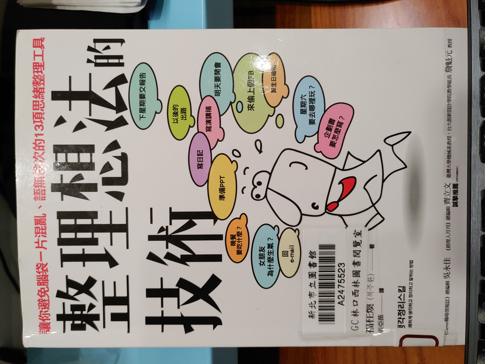
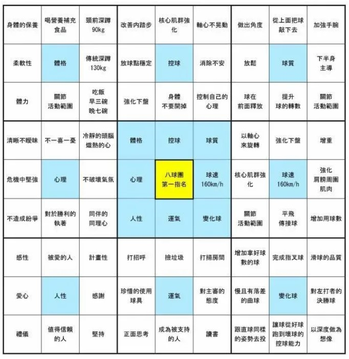
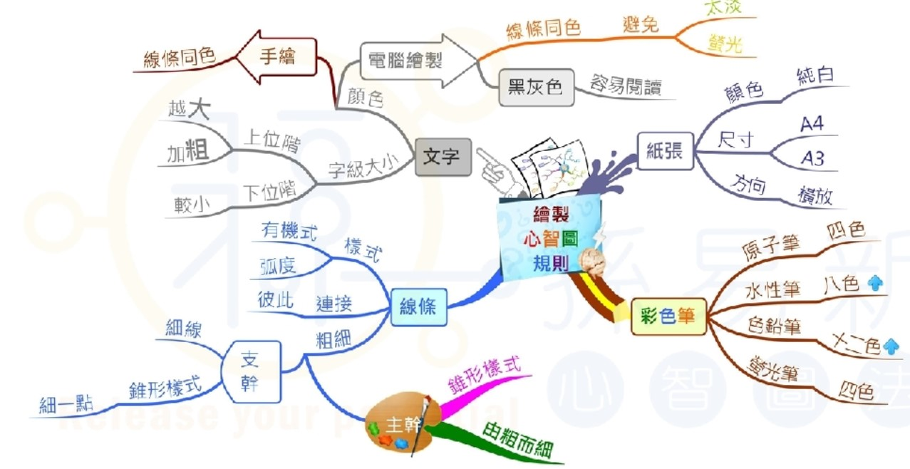
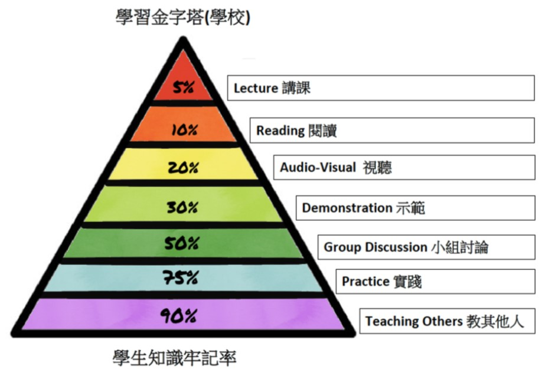
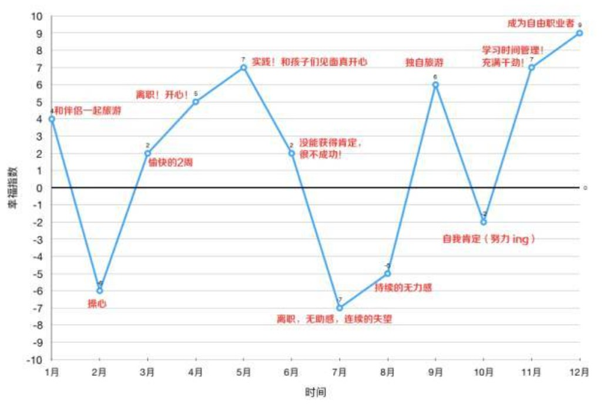

- [書本資訊](#書本資訊)
- [用一段話敘述書本要傳達的內容](#用一段話敘述書本要傳達的內容)
- [書本目錄&各章重點](#書本目錄各章重點)
  - [第一章-重新認識「想法整理」](#第一章-重新認識想法整理)
  - [第二章-整理不了想法的根本原因](#第二章-整理不了想法的根本原因)
    - [將腦中無形想法可視化](#將腦中無形想法可視化)
    - [運用整理想法的工具](#運用整理想法的工具)
    - [善用整理想法的原理](#善用整理想法的原理)
      - [羅列-挖掘想法:](#羅列-挖掘想法)
      - [分類-整理想法:](#分類-整理想法)
      - [排列-決定想法的優先順序:](#排列-決定想法的優先順序)
      - [提出問題延伸想法，再加以整理](#提出問題延伸想法再加以整理)
  - [第三章-聰明整理複雜思緒的方法](#第三章-聰明整理複雜思緒的方法)
    - [曼陀羅圖](#曼陀羅圖)
    - [心智圖](#心智圖)
  - [三的邏輯樹](#三的邏輯樹)
  - [第四章-讓單純想法成為點子的方法](#第四章-讓單純想法成為點子的方法)
    - [企劃](#企劃)
    - [企劃vs計畫](#企劃vs計畫)
    - [文案四大天王](#文案四大天王)
    - [企畫執行步驟](#企畫執行步驟)
    - [創意發想方法](#創意發想方法)
    - [一頁企畫書](#一頁企畫書)
  - [第五章-長久記憶的閱讀整理技術](#第五章-長久記憶的閱讀整理技術)
  - [閱讀整理技巧三階段](#閱讀整理技巧三階段)
  - [讀書前的閱讀](#讀書前的閱讀)
  - [讀書中的閱讀](#讀書中的閱讀)
  - [讀書後的閱讀](#讀書後的閱讀)
    - [✨一頁閱讀整理法](#一頁閱讀整理法)
  - [第六章-掌握整理想法技術可以連帶提升演說力!](#第六章-掌握整理想法技術可以連帶提升演說力)
    - [整理想法演說的五階段過程](#整理想法演說的五階段過程)
  - [第七章-整理想法具有改變人生的力量](#第七章-整理想法具有改變人生的力量)
    - [寫日記](#寫日記)
    - [人生座標圖](#人生座標圖)
    - [願望清單 (Bucket List)](#願望清單-bucket-list)
  - [閱讀心得](#閱讀心得)
# 書本資訊
- 書名: 整理想法的技術
- 作者: 福柱煥
- 譯者: 張亞葳
# 用一段話敘述書本要傳達的內容
人人都需要想法整理，從家庭主婦到大學教授，從年輕人到老年人，無論是誰都需要學習想法整理。想法整理運用得當可以改變一個人的心情、工作、環境、甚至是人生。

# 書本目錄&各章重點

## 第一章-重新認識「想法整理」
- 誰需要學習想法整理?
    - 學生
    - 職場人士
    - 一般人士
    - 專家
- 是否具備想法整理技術的差異
    - 有嫻熟技術者
      - 思路清晰簡明、思考具邏輯性、掌握資訊的核心
      - 有整理想法得習慣
      - 計畫之後再行動
    - 不了解或無技術者:
      - 思考漫無邊際
      - 沒有整理想法的習慣
      - 工作效率低 
- 整理想法是一門技術，並且可以透過練習提高執行力
## 第二章-整理不了想法的根本原因
- 三大原因:
    - 不清楚自己的想法
        - 解決辦法: 將想法可視化
    - 沒有運用整理想法的工具
    - 沒有善用整理想法的原理

### 將腦中無形想法可視化
- 用口說出
- 用手寫下
### 運用整理想法的工具
- 利用工具將想法整理成可見之物
- 各種工具: 便條紙、心智圖、邏輯數、腦力激盪法、網路筆記本等等
    - 世界上已知整理想法工具超過300個
- 模擬工具 vs 數位工具
  - 前者優點:
    - 無論何時何地都可以輕鬆紀錄
    - 用手寫方式紀錄時可以刺激大腦
  - 缺點:
    - 修改較慢
  - 後者優點:
    - 修正、刪除、移動相較於前者容易的多
    - 可以附加需多相關的檔案
    - 多數可以儲存到網路上
  - 缺點:
    - 檔案一經刪除就無法復原
> 工具不是知道愈多愈好，重要的是懂得如何運用
### 善用整理想法的原理
- 額葉喜歡的想法整理原理
    1. 右腦發出，左腦接收
        - 發想創意時盡可能挖掘大量點子(右腦)
        - 再由大腦進行整理統整(左腦)
    2. 羅列、分類、排列
    3. 提出問題延伸想法，再加以整理
- 可以與其他工具一起利用: 心智圖、曼陀羅圖、腦力激盪法、邏輯樹等工具
#### 羅列-挖掘想法:
  - 將腦海中的訊息一一列下來
#### 分類-整理想法:
  - 列出想法之後，接下來就是加以分類
  - 可以利用的分類基準: 時間的種類、地點的種類、任務的種類、優先順序的種類等等
#### 排列-決定想法的優先順序:
- 將想法轉為行動的階段
- 根據重要性來排列出順序

#### 提出問題延伸想法，再加以整理
- 提出適當的問題，來釋放封閉的思維
- 問問題可以從六何原則下手
  - 六何原則: 何人、何時、何地、何事、如何、為何
- 再接連不斷的提出問題的過程中，能讓想法不斷的延伸
> 開啟想法的不是答案，而是問題。

## 第三章-聰明整理複雜思緒的方法
### 曼陀羅圖
- 曼陀羅圖的使用情形: 當想要達成目標時
- 曼陀羅: 用重疊的圓形、四角形和蓮花等來表現領悟境界的佛畫面
- 概念: 由中心的九宮格延伸出另外八個子項目的九宮格，而每一個九宮格的中心點就是想要達成的目標
- 
- 優點: 
  - 透過一張紙便可以看到內容
    - 總共有8*9=72個步驟來達成最終目標
  - 利用想要填補空格的心理
    - 九宮格上的每一個項目就像是一個子任務，像玩遊戲一樣慢慢達成所有的任務便可以達到最終的目標
  - 能夠具有邏輯性整理想法
      - 以中心目標為最終結果(中心主題)，周圍開展的8格分別是首要主題，以首要目標再延伸出去的九宮格為次要目標
### 心智圖
- 直線型思考和典型筆記方式有缺點，大腦比較不容易記住
- 順應人類大腦的自然現象: 放射思考(radiant thinking)
- 概念: 像樹枝向四方呈放射狀的結構圖。中心樹幹是核心觀念或主題，連接樹幹的是大樹枝也就是首要主題或章節，而大樹枝之下的小樹枝就是次要主題以及章節中的內容。

## 三的邏輯樹
- 數字3遠從古代就是我們生活中象徵完整的數字
- 整理出3項要點，並且有邏輯性的將想法傳達給對方可以使人留下深刻且長遠的記憶
- 3具有完美之意
    - 舉例時列出2項感覺有點少，列出5項又太多記不住
- 3的邏輯樹: What tree、Why tree、How tree
- 例如: 以what tree舉例: 最左側是What，緊接者右側三項是構成的要素，而右側9項子項目就是構成該要素的三個原因。

## 第四章-讓單純想法成為點子的方法
### 企劃
- 所謂的企劃就是整理想法的活動
- 所謂的企業顧名思義，就是企劃的行業
- 企劃是將期盼和想法加以整理的活動

### 企劃vs計畫
- 企劃是大方向圖，計畫是細部圖
- 企劃是涵蓋整體的想法(What)，計畫是如何執行的細部想法(How)
    - 以建築做比喻: 企劃是設計圖，計畫是行程表

### 文案四大天王
- 企劃書:指 將要進行的事情
- 計劃書: 如何進行的內容
- 提案書: 要提議的內容
- 報告書: 說明目前項目進展情況的圖表 

### 企畫執行步驟
- 企畫的核心是解決問題的過程:
1. 掌握問題
   1. 掌握要解決的問題
   2. 分清楚需要與想要的分別是什麼
2. 分析現況
   1. 從多角度來分析問題
   2. 收集足夠的資料
   3. 可以運用3的邏輯樹來分析
3. 企劃設計
      1. 根據掌握的現況來設計
      2. 將解決問題的方法具體化
4. 細部計畫
   1. 企劃大方向出來之後再針對時間、地點、人、以及如何進行來建立細部計畫
   2. 根據計畫製作一頁企畫的設計圖，方便檢討
5. 執行
   1. 以企劃書為範本執行內容
   2. 持續檢討
6. 解決問題(達成目標)
7. 檢討
   1. 在過程中不斷持續檢討之外，目標達成之後也要檢討自己的策略和方法
   2. 當企劃完成時，記錄下成功要素和感到辛苦的部分，可以幫助日後回想

### 創意發想方法
1. 腦力激盪法(Brainstorming)
    - 更多關於腦力激盪法的內容可以參考: https://zh.wikipedia.org/wiki/%E8%85%A6%E5%8A%9B%E6%BF%80%E7%9B%AA%E6%B3%95
2. 腦力傳寫法(Brain Writing)
    - 與腦力激盪法依樣是提出各式各樣的創意，但表達方式不同
    - 腦力激盪法是透握口述，而腦力傳寫法是透過文字表達想法
    - 能夠鼓勵被動的人或不敢在別人面前發表意見的人參與
    - 更多關於腦力傳寫法的內容可以參考: https://en.wikipedia.org/wiki/6-3-5_Brainwriting
3. 問題圖
   - 基於六何原則將想法延伸並整理的方法
   - 問題的公式: 「(主詞) + (六何原則) + (動詞) ?」
   - 想要增加提出的數量可以採用: 「(主詞) + (動詞) + (六何原則) ?」
     - 每一個不同的動詞都可以提出額外六項問題
   - 延伸思考: 「(主詞) + (主詞)  + (動詞) + (六何原則)」
     - 將性質不同的主詞放在一起
   - 結合心智圖畫成圖表

### 一頁企畫書
- 一頁企畫書不是讀完之後了解內容，而是閱讀的當下便掌握內容
- 一頁企畫書的必備項目:
    1. 主題: 企劃的主題是什麼?
    2. 核心: 內容想要用一句話表達什麼
    3. 企劃: 什麼背景造就企劃?
    4. 目的: 希望透過企劃獲得什麼?
    5. 目標: 想要獲得的具體部分是什麼?
    6. 費用: 明確的預算是多少?
    7. 期待: 成效企劃和利益是什麼?
    8. 實行: 計畫如何具體實行?
## 第五章-長久記憶的閱讀整理技術
## 閱讀整理技巧三階段
1. 讀書前的閱讀
2. 讀書中的閱讀
3. 讀書後的閱讀
> ✅讀多少書並不重要，即使只有一本書，把它讀懂讀好才重要。

## 讀書前的閱讀
透過觀看:
- 封面
    - 對書名提出疑問
    - 對書本內容提出疑問
    - 從封面推敲答案
- 作者介紹
    - 了解作者可以幫助充分了解書籍
- 書本前言
    - 作者寫書動機
    - 預設讀者
    - 書籍主題
> ✅藉由提出問題尋找並推敲答案，在腦中描繪出關於這本書的輪廓
## 讀書中的閱讀
- 觀看書本目錄
- 記憶目錄的方法
    - 將目錄內容轉換為一個故事或文章
- 掌握核心內容
    - 以搜尋的方式尋找內容
        - 帶著好奇心尋找書的內容，就能長久記憶
    - 用繪圖來整理
        - 可以使用心智圖
## 讀書後的閱讀
可以增加記憶的後續活動:
1. 寫讀後感
    - 以主觀感覺為主
2. 寫書評
   - 較為客觀
3. 參加讀書會
    - 將自己整理的內容分享給其他人，更能夠形成長期記憶
4. 做讀書筆記
    - 根據書本的重點做筆記大綱，並且可以利用這個大綱來撰寫書本閱讀文章

- 學習效率金字塔: 下圖源自美國行為科學研究機構NTL的"學習效率金字塔"

 
如果我們能將自己整理出的內容傳達給別人，比較能夠完美理解書的內容並且長期記憶。

### ✨一頁閱讀整理法
這一頁中包含幾項內容:
1. 讀書報告:
  - 種類
  - 書名
  - 作者
  - 開始日
  - 結束日
2. 閱讀動機
3. 書籍資訊
4. 書籍內容(大綱)
5. 印象深刻的句子
6. 讀完之後的想法或感受
## 第六章-掌握整理想法技術可以連帶提升演說力!
- 演說需要整理想法的三個理由:
   1. 演說是公開的談話
   2. 演說是具目的性的談話
      - 目的可以分為四種: 資訊提供性演說、說服性演說、禮貌性演說、娛樂性演說
   3. 演說是傳達內容

- 推薦學習的放向: 先整理想法，再準備表達。
- 培養演說能力的方法就是平時整理想法
- 對演講來說，最重要的事實就是"找到你想要表達的一句話"

### 整理想法演說的五階段過程
演說的整理順序依序是:
1. 決定向誰演說
   1. 具體界定聽眾(年齡、職業類別等)
   2. 找出聽眾所需要的訊息
2. 選定想要演說的主題
   1. 找出最想要傳遞的一句話
   2. 根據這句話做延伸，可以使用曼陀羅圖來延伸擴大內容
3. 羅列問題，簡略整理要點
   1. 延伸為大綱的方法就是提出問題!
   2. 從各個角度提出和他有關的問題，羅列並整理順序
4. 設計目錄
   1. 配合序論、本論、結論
5. 以各種事例豐富內容，再編寫成需要的演講稿
   1. 別人製作的資訊: 例如文獻、書本資料
   2. 存在於現場的資訊:現場調查，信任度最高的資訊
   3. 個人保有的資訊: 自身經驗、想法和想像等等
   4. 巧妙運用這三種來源收集到的資訊可以豐富一場演說
## 第七章-整理想法具有改變人生的力量
人生整理技巧的三種工具: 日記、人生座標圖、願望清單

### 寫日記
- 拋開必須寫出好文章的強迫觀念
- 可以記錄時間、地點、做了什麼?
- 正面用語比負面用語好
    - 因為日記是和過去、現在，以及未來的自己對話
    - 範例: 
      - 「好累」--> 「雖然目前很辛苦，但我可以克服」
      - 「好想放棄」--> 「我將不會放棄」
      - 正面的思考帶來正面的行動與結果

- 寫日記是為了保存過去的記憶

- 寫日記是為了創造並準備未來
  - 把當下的創意記錄下來
  - 把夢想寫下來
- 日記是人生的指南針
    - 把每天必須實踐的人生目標記錄下來

- >瑣碎的日常小事累積起來就能形成想法的大數據，而能夠分析這種數據的工具就是人生座標圖。

### 人生座標圖

- 幫助檢視過去人生的走向
1. 繪製人生座標圖的三個階段:
- 設定人生座標圖的期間
  - 要以出生到現在的時間?還是過去一年，按照月份整理成圖表?
- 加入核心關鍵字並標點
  - X軸代表時間，Y軸代表情緒指數
- 點與點之間想連成線
  - 把標好的點相連成線

2. 分析幸福指數
    - 人生座標圖是為了分析自己和人生的方向
    - 明確分辨出「喜歡的是事情」和「討厭的事情」之後，在設定人生方向時就顯然成為助力

### 願望清單 (Bucket List)
- 幫助規劃未來夢想的工具
- 好處:
    1. 發現自己所喜歡的事物，幫助你更了解自己
    2. 製作願望清單並加以實踐時，你會達成夢想，同時提升能力
    3. 當你所挑戰的不是無法達成的「不著邊際的夢想」，而是能夠達成的「具體夢想」，你對生命的滿足感也會增加。
- 製作三階段:
    1. 製作願望清單
    2. 決定先後順序
    3. 實踐願望清單

## 閱讀心得
這本書也是一本比較容易閱讀的書，每一章節中的文字內容都不會太多，在閱讀的過程中可以很快速的理解作者想要傳達的觀念。除了這些觀念之外，作者還有在書本中提到13種心智工具可以幫住我們進行創意發想或是整理想法。總體來說是一本可以快速閱讀又學到知識的書本。
