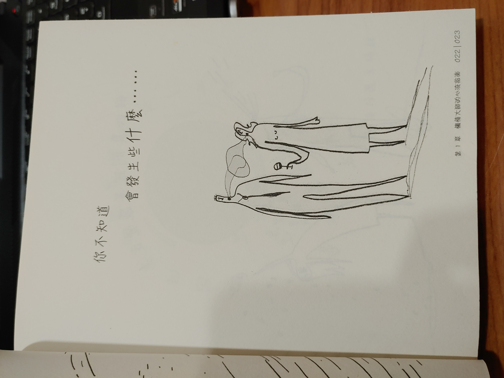
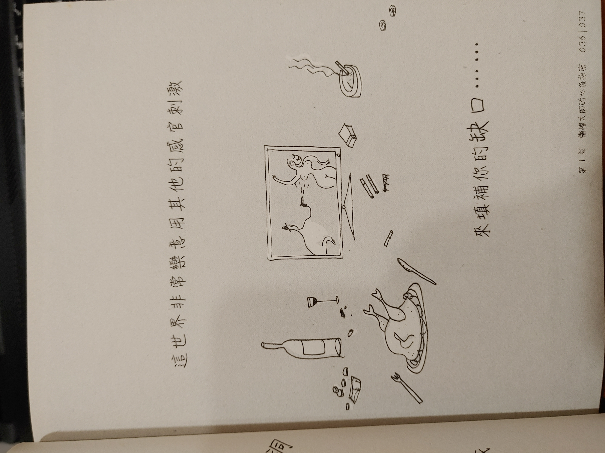
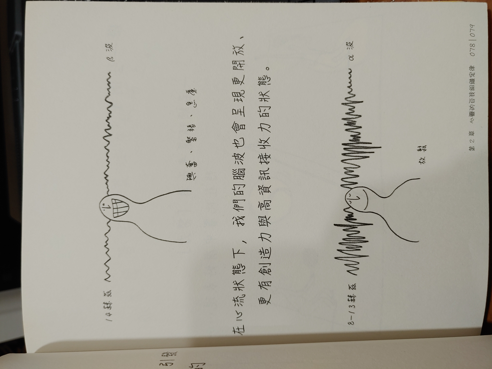
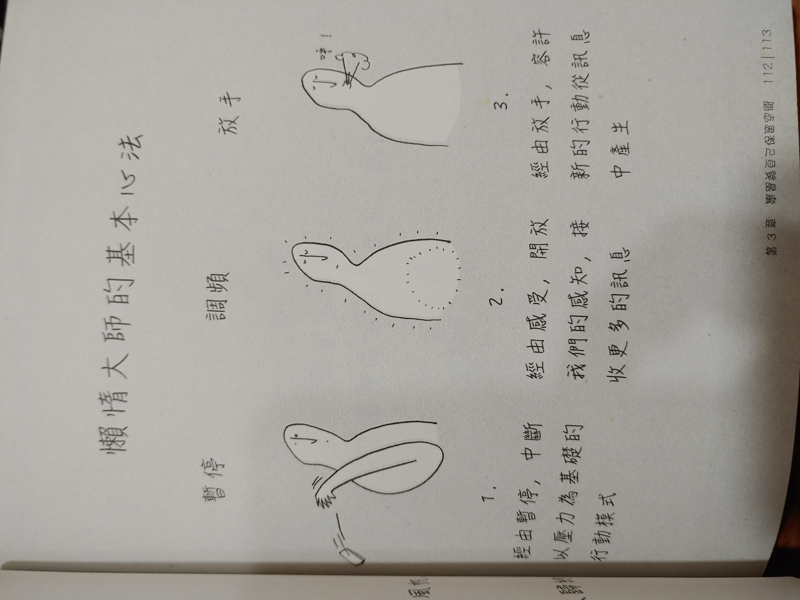
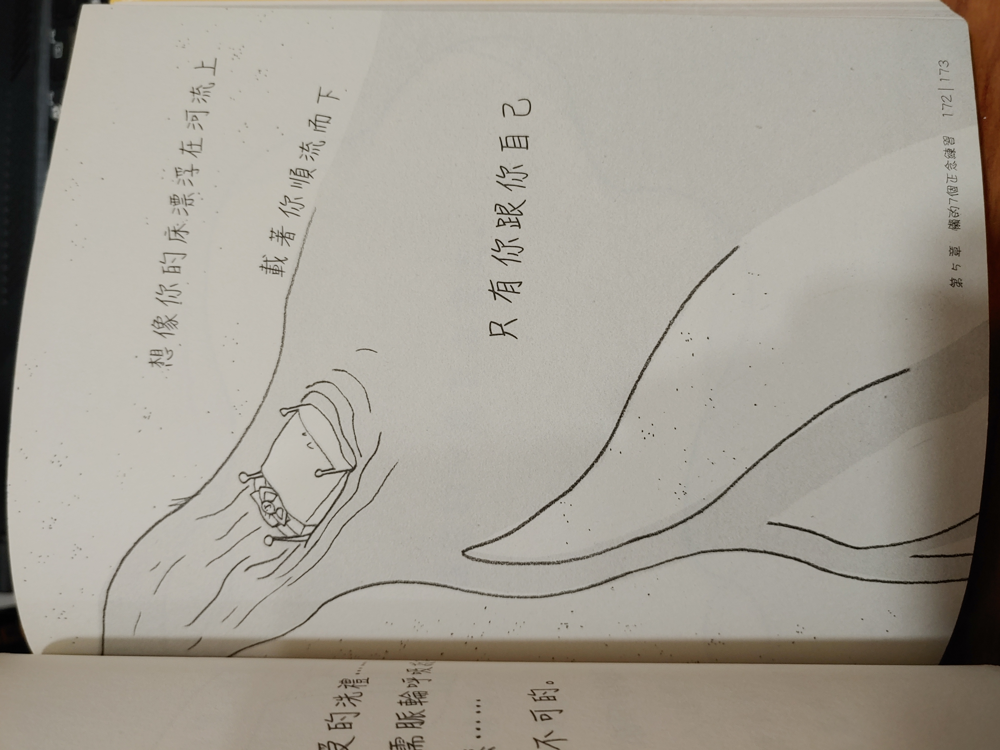

# 書本資訊
- 書名: 懶，讓你變得更好: 做的少卻獲得更多的正念藝術
- 原文書名: The Lazy guru's guide to life: The mindful art of achieving more by doing less
- 作者: Laurence Shorter/Magali Charrier
- 譯者: 孫昭業
- 出版商: 日月文化出版股份有限公司

# 用一句話敘述書本要傳達的內容
停下來喘口氣，讓心靈自然的漂流，讓慵懶大師教你三個基本心法，以及七項能立即放鬆的練習，使我們可以充滿靈感與創意，學會用以往不同的方法有效率的解決問題。

# 書本佳句
>「無論是一項計畫、任務、一段夥伴關係或是一個創意，這世上的每個事物都具有讓自己充分成長和發展所需要的資訊。 控制的愈少，發展得愈好。」
# 書本重點節錄
## 心靈與心流
- 不要將感受封閉在"盒子"裡，最好的做法就是什麼都不做，順隨心流
- 順隨心流: 把思想把在一旁，並且容許其他事情發生
  - 等待潛意識的發揮，等待靈感湧現
## 為自己保留空間
- 進入心流最好的練習，就是為自己保留空間
- 懶惰大師的三項基本心法:
  - 暫停: 中斷以壓力為基礎的**行動**模式
  - 調頻: 經由感受，開放感知，接受更多的**訊息**
  - 放手: 容許新的**行動**從**訊息**中產生

## 3個基本心法
1. 暫停: 
   1. 學習暫停，讓大腦抽離壓力漩渦
   2. 無用的信念: 「必須加快腳步」、「生活是一場戰鬥」、「我有強者可以生存」
   3. 訣竅: 學習察覺你過的不開心的時候，代表自己不在心流狀態
   4. 好處: 讓你掌握心流狀態
2. 調頻:
   1. 將頻率對準身體的各個知覺(感受)
   2. 無用的信念: 「我有太多事情要做」、「我得工作」
   3. 訣竅: 練習單純描述身體內在與外在的感受，不要替這些感受貼標籤(好or壞)
   4. 好處: 提升活力、靈感、生產力等
3. 放手
   1. 放下不必要的情感: 憤怒、埋怨、悲傷或驕傲等，放下對事物的執著
   2. 無用的信念: 「我計畫好了」、「我必須這樣」
   3. 訣竅: 留意自己說出「應該」兩個字的頻率，如果將這兩個字換成「可以」會發生什麼事?
## 7個懶的正念練習
1. 善待自己
   1. 壓力腦傾向把所有事情**災難化**，並且這些想法將在那些緊緊關閉的盒子中。
   2. 唯一需要做的事，就是給他空間。當它是一個不太快樂的小孩，允許這個小孩不快樂
   3. 只要陪伴他就好，這些感覺會一點點的自行轉變
2. 在床上冥想
   1. 什麼都不做
   2. 處於警覺狀態的時候，早上起來很厭世的時候，都可以停下來，並且等待
   3. 接受各種感受的洗禮，沒有催促，沒有目標，就只是放鬆，讓你的心靈自由漂流
3. 丟掉你的「應該」
   1. 太多的「應該」導致我們與會評斷自己和他人，給自己徒增壓力
   2. 解決辦法: 單純的**觀察**"他們"，無論他們看起來多麼正確或符合邏輯
   3. 問問自己: 「他為甚麼這麼重要?」、「真的是這樣嗎?」「假如這個「應該」真的發生了，事情會有所不同嗎?」
4. 清除雜亂
   1. 習慣和信念不只會影響到內在，也會影響到現實環境，時間一久，雜亂會阻礙內在智慧的生命領悟的流動
   2. 把不必要的東西清掉(刪除、丟掉、清洗、打掃)
   3. 要清除的不只有形的物質，內心的壓力也要
      1. 可以透過寫日記的方式將觀察到的都寫下來
      2. 充滿愛的見證它發怒與抓狂
      3. 寫下所有不理性、偏執以及擔憂的想法
5. 紓解壓力
   1. 典型的方法可以放鬆精神和肌肉，但都是短期的(運動、酒精、性愛、音樂)
   2. 更有效的紓解方法: 暫停、調頻、放手，必且讓自己的身體動起來
6. 保持專注
   1. 試試騰出空間的感覺，不做任何事
   2. 拋開所有會讓你分心的事物，讓自己無所依賴，無處藏匿
7. 分享感受
   1. 誠實與他人分享自己的感受
   2. 仔細解釋: 不帶責備或指控，單純地描述你所經歷的一切
   3. 說與聽: 分享、描述、坦承、傾聽、等待、回應
# 閱讀心得
    很喜歡這本書，雖然是很輕鬆的小品，大概不到20分鐘就可以看完的插畫書，但是這本書所傳達的內容是有用的。書本內與冥想、正念等所傳達的關念很類似，作為我閱讀的第一本心靈相關的書籍來說真的太棒了。 也許我在看過更多關於冥想相關的書籍之後會對這本書有更進一步的認識。

# 書本圖片節錄
- 書本中的插畫很可愛，中文字體也是選用比較鬆可愛的，非常適合休息放鬆的時候觀看。

