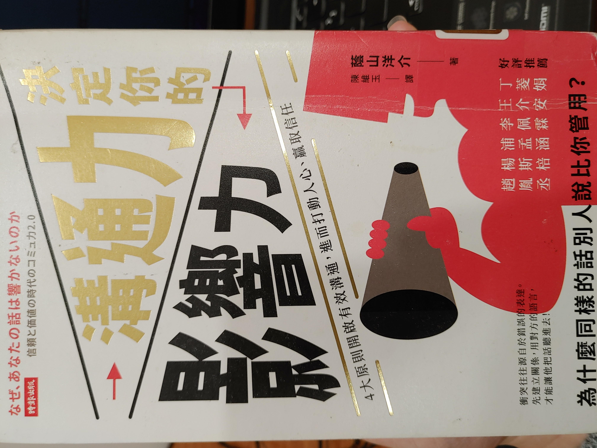

- [書本資訊](#書本資訊)
- [用一句話敘述書本要傳達的內容](#用一句話敘述書本要傳達的內容)
- [經典好句](#經典好句)
- [書本目錄&各章重點](#書本目錄各章重點)
  - [第一章: 進入以溝通能力劃分階級的社會](#第一章-進入以溝通能力劃分階級的社會)
  - [第二章: 為什麼當前的溝通技巧已不再管用?](#第二章-為什麼當前的溝通技巧已不再管用)
    - [Ⓜ️傳接球遊戲](#️傳接球遊戲)
    - [Ⓜ️自我價值](#️自我價值)
  - [第三章: 不敗的「溝通力2.0」](#第三章-不敗的溝通力20)
    - [Ⓜ️打造自我價值](#️打造自我價值)
    - [Ⓜ️提升自我價值](#️提升自我價值)
    - [Ⓜ️從硬體到軟體](#️從硬體到軟體)
  - [第四章: 打動人心的「說話方式2.0」](#第四章-打動人心的說話方式20)
    - [Ⓜ️接受力](#️接受力)
    - [Ⓜ️為了贏得勝算的討論](#️為了贏得勝算的討論)
    - [Ⓜ️如何表達自己](#️如何表達自己)
    - [Ⓜ️設定我自我定位](#️設定我自我定位)
    - [Ⓜ️原本論](#️原本論)
    - [Ⓜ️練習&勇氣](#️練習勇氣)
- [心得](#心得)
# 書本資訊
- 書名: 溝通力決定你的影響力:4大原則開啟有效溝通，進而打動人心，贏取信任
- 作者: 蔭山陽介
- 譯者: 陳維玉
# 用一句話敘述書本要傳達的內容
溝通力就是影響力。本書先介紹現今社會溝通力的重要性，接者說明何謂"溝通"。最後在第三章與第四章再說明溝通力2.0(傳遞自我價值的溝通)以及說話方式2.0(具有引導的說話方式)。書中也有提到提升自我價值的方法。

# 經典好句
> 「人與人對話是一種互相傳遞資訊或情感的傳接球遊戲，以進行對話這個行為的目的性來看，對話是一件有趣的事。」
> 「能讓對話順利進行的前提是擁有自我肯定的能力。」
> 「溝通是一種價值的交換。」

# 書本目錄&各章重點
## 第一章: 進入以溝通能力劃分階級的社會
- 什麼是溝通能力?
  - 能馬上和不認識的人打成一片，掌握現場氣氛並與之取得平衡後，提出有成效的建議，進而控制全場的一種能力
- 具有溝通力的人擁有
    1. 適應力
    2. 觀察力
    3. 提出自我意見能力
   - 這三種力分開來看過強都可能有缺點，而具有溝通力的人就是同時兼具這三種能力的人。
- 社會逐漸不再把「專精於某個領域」視為一件了不起的事
  - 溝通力與專業能力都是左右成功的關鍵。
- 不需要溝通力的工作，未來將會消失
  - 人工智慧擅長處理的工作技術、內容重複高的工作都很容易被取代。
  - 反之，需要高度陪伴及高度溝通能力的工作仍然會存在。
    - 必須深入心靈層次的交談溝通，依舊是人類與生俱來的優勢。
- 原本的溝通力已經不夠用:
  - 現代社會強調價值觀多樣化，使得我們難以發表個人的意見。
  - 現代社會流動性過於劇烈，導致基礎認知漸漸動搖。
  - 需要溝通力2.0
- 本書溝通力詞彙:
  - 溝通力1.0: 一邊解讀周遭氣氛，一邊提出自我意見
  - 溝通力2.0: 先擁有自我價值，再為了贏得他人信賴而進行溝通

## 第二章: 為什麼當前的溝通技巧已不再管用?
### Ⓜ️傳接球遊戲
- 溝通原本就是傳接球遊戲
  - 需要兩人以上參與、互相進行傳接球的遊戲
  - 參加者要將球丟給對方，等待另一個人接到球之後再把球丟回來
  - 傳接球的原意:「投球者與接球者之間進行某種物質交換的模式」
  - 人與人之間的對話就是如此
    - 話說出去相當於把球丟出去，屬於不安定的狀態，無法保證球會抵達目的地。
- 溝通用傳接球可以比喻為以下兩點
    1. 投球與接球者雙方進行某種意見交換的不確定行為
    2. 其本身有樂趣存在，可讓人樂在其中
- 溝通力的原則
    1. 使不確定的意見交換成為事實的能力
    2. 讓溝通本身變得有趣的能力

### Ⓜ️自我價值
- 能讓對話順利進行的前提是擁有自我肯定的能力
  - 然而，自我肯定的難度隨著時代的演變逐漸提高。
  - "實現夢想"並不是一件容易的事情
  - 對於找不到"想要做的事情"的人，社會的普世判斷標準是"經濟上的成功"
    - 這並非廣泛適用於每個人
    - 隨者階級差距日漸明顯，個人收入要達到一般標準都很困難，導致現代社會對經濟上的成就評價不高
    - 改成較為重視「實現夢想」這種具備多元價值的想法

- 藉由相信自我的價值、自己喜愛的事物或寄託在自己想要完成的事物上，找回自信，重起溝通的可能。
- 只有「傳達」思考方式或資訊的溝通，已經無法讓對方產生共鳴，所以必需要進一步建立自我「價值」，且擁有自信來取得「價值」之間的交流與溝通
- 

## 第三章: 不敗的「溝通力2.0」
- 溝通力2.0: 先擁有自我價值，再為了贏得他人信賴而進行溝通
  - 反向利用人類的心理，將自己那股非日常的預感，傳達給對方
    - 「跟你在一起，便覺得有非常愉快的事情在等著我」
    - 「感覺可以抵達某一個比現在還有趣的地方」
  - 提出有未來性且能持續成長的展望 
- 溝通得重點在於價值
  - 避免帶給他人「那個人只會耍嘴皮」的不良印象
  - 要給人「那傢伙雖然不太會講話，但他講的話還滿值得聽」
  - 只有當對方信賴你的價值的時候才會願意聽你說話 

### Ⓜ️打造自我價值
- 先從自我開始
  - 清楚認識自己擁有的天賦
  - 外在、內在
  - 不應該拿自己與其他人比較

>⚠️在不與他人比較的情況下，怎樣打造出更具個人魅力的自己，便是溝通技巧訓練的目標。  

- 自我價值是由「過去的你」、「現在的你」、「未來的你」做組成
  - 「過去的你」: 履歷表上的自己、照片中的你 
  - 「現在的你」: 現在的擁有的技能、個性(內在)、打扮(外在)等
  - 最重要的是「未來的你」:未來的成長&價值
    - 未來的樣貌與過去和現在的表現無關，而是與你現在的價值有密切的關係
> ⚠️用最高價值銷售自己的方法，是利用對「成長」的期待值

- 自己是否進步成長，在周遭的人看來會有明顯的差別
  - 朝夢想努力的人，無論性別，都匯流露出一種魅力
> ⚠️為了讓自己的價值最大化，最重要的關鍵是持續成長和進步

### Ⓜ️提升自我價值
1. 設定「憧憬的自我」: 透過模仿嚮往的對象
     - 有計畫的學習: 嚮往的對象吸收那些知識，學習那些技能，平常又在做什麼?
2. 建立「品牌」以彰顯是我價值
     - 品牌(商標)可以排除與自身理念不相符的人，相反的，可以吸引與自身理念相近者
3. 從購買皮包開始
     - 重點不在價錢，而在能夠彰顯自己的價值
     - 擁有皮包之後再去看符合這個皮包的衣物、鞋子、外套等
     - 付出行動(購買皮包)遠比腦袋中想像來的具體，也比較容易向外界傳達你的想法
4. 丟棄不必要的東西
     - 丟棄無用的東西，能讓你對價值的定義以及認同更加明確
5. 整理房間，消除「噪音」
     - 與第3、4點相同，將房間打造成最能彰顯自我價值的空間  
6. 認清心中的價值
      - 改變自己的行動與經歷
      - 經歷的事物，會隨著當事者認同的價值觀而改變
      - 以自己的角度去詮釋各式各樣的經歷，有助於自我價值的提升

### Ⓜ️從硬體到軟體
從改變幅度最小的開始做:  
1. 房間的佈置
2. 服裝搭配
3. 每天的學習內容和經歷
4. 檢視自我價值

  

## 第四章: 打動人心的「說話方式2.0」
- 正確的說話方式其實不存在
  - 比較好的方式是與學習"理想中的自己"或是"嚮往對象"的說話方式

### Ⓜ️接受力
1. 理解對方說的話
    - 透過"換句話說"的方式讓對方認為你了解對方要說的話 
2. 理解對方想要做的事情
    - 找出對方文字中傳達的「真正想要做的事情」
3. 達成共鳴
    - 將個人的意志轉向"情感"，才是對話真正的開始
4. 建立認同
    - 貼近對方的情感的步驟已經算是一種認同
    - 在展現"實在很棒"的共鳴的時候，為了要深入理解對方，必須要在事前進行相關資訊的蒐集&學習

### Ⓜ️為了贏得勝算的討論
1. 建立信賴關係
    - 在意見不同之前先建立信賴關係，即使意見相左，對方也比較聽得進去
2. 侵略性溝通
    - 與對方保持共識，藉此旁敲側擊出對方真正的想法
    - 一邊提問一邊整理對方的論點
    - 利用對方的論點或想法來提出挑戰性的語氣提問
      - 例如: 「你說....，但是這樣真的好嗎?」
      - 讓對方自己動搖
      - 利用自己的語言，提出與對方相反的論點和批評
### Ⓜ️如何表達自己
- 如何說出自己內心真正的想法?就是要擁有被討厭的勇氣
- 不能只有被討厭的勇氣，還要有充分的事前準備
    1. 達到充分的共鳴
    2. 設定對方觀感中的自我定位

### Ⓜ️設定我自我定位
- 讓對方認同自己是適合敘說這項建議的人物
- 不要向人低頭
- 透過明確表達「自己是什麼樣的人?有過哪些經驗?擅長什麼事物?」來提高自己發言時的力量。
- 透過清楚顯示自己的背景經歷，不只能發出強而有力的言論，也可以增加自由發言的機會。
  - 背景經歷會限制自己的發言
  - 取而代之的是，某些特定領域的言論力量會增加

### Ⓜ️原本論
- 將對方的意見與人格本身進行切割
  - 不帶批評的陳述意見
- 將問題抽象化，以重新思考討論概念本身的價值

### Ⓜ️練習&勇氣
- 溝通力的提升還是需要經過大量的練習
- 將自我價值關擺在社會中檢視，是非常需要勇氣的一件事
  - 如果沒有勇氣，先前提到的方法都只會流於形式，不會有效果

# 心得
    1.這本書相較於前一本書"專注，是一種資產"，來的比較不容易閱讀，一方面是敘述比較多，二方面是後者的書籍內容實在太簡單，基本上都是作者的故事。我自己這樣讀下來發現無論是原子習慣(習慣)或是溝通力就是影響力(溝通)這兩本書都在傳達同一個概念，「身分認同&自我價值」。想要徹底的改變一個人最簡單也是最實用的方法就是從內在(自我價值)開始改變，進而引發外在(習慣、談吐、穿著)的改變。因為一個人的外在表象與行為都是內在心理的映射，當人們嘗試做出與內在不符合的外在行動反而會讓自己感到不舒服。當然本書中也有提到如何提升自我價值的做法，從比較外在的作法(改變房間格局、購買衣物)到內在的做法(學習憧憬對象的行為、檢視自己的學習內容&經歷)等都有論述，而我自己也認為自我身分認同與價值的轉變不單純是單向的(從內到外)，而是雙向，甚至是快速循環的。
    2. 自我價值的轉變:內在的小改變-->外在的改變-->接受反饋--->內在歡喜-->內在小改變-->外在的改變-->....(形成一個持續改變的循環)